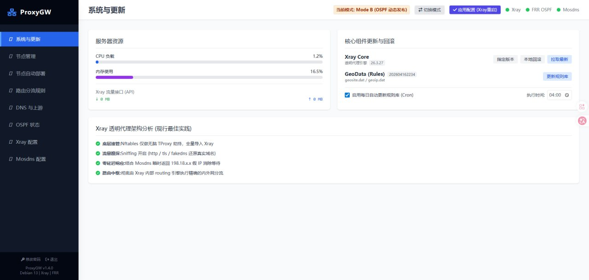

# ProxyGW 文档导航

建议阅读顺序：
1. `OPERATIONS.md`（部署指南/排障/SOP）
2. `API.md`（接口约定）
3. `CHANGELOG.md`（版本变更）
4. `RELEASE_TEMPLATE.md`（发布记录模板）

## ProxyGW 透明代理网关

ProxyGW 是一款基于原生 Debian 12 / 13 的透明代理管理系统，它整合了 Xray-core、Mosdns v5、FRR (OSPF) 以及 nftables (TProxy)，提供了现代化的 Web UI 进行全自动化配置与网络路由管理。




### 架构特性

- **Native Linux**：纯物理机/虚拟机架构，深度融合 Linux 网络栈，严禁引入 Docker 等虚拟化容器影响性能。
- **透明路由**：支持 TProxy 模式（nftables）与 OSPF (FRR) 模式，适应旁路由、透明网关等多种网络拓扑。
- **DNS 防漏**：内置 Mosdns v5，通过 GeoData 实现精准分流解析，完美解决国内外 DNS 污染与泄漏问题。
- **现代化 UI**：Vue 3 + TailwindCSS 前端，单文件 `index.html` 极简部署。无刷新状态更新。
- **安全性**：全 API 鉴权，移除了硬编码默认密码，使用 bcrypt 存储凭据；强校验抵御命令层注入。
- **开箱即用**：提供一键安装脚本，自动处理依赖与服务注册。

### 目录结构

```text
/root/proxygw
├── backend/          # Go 编写的 API 后端与控制逻辑
├── frontend/         # Vue 3 编译产物 (index.html)
├── core/             # Xray 与 Mosdns 运行期目录 (含日志与规则)
├── config/           # SQLite 数据库与凭据存放目录
├── systemd/          # Service 文件
├── scripts/          # 部署脚本与运维工具
└── docs/             # API 说明与运维手册
```

### 快速开始

请参阅：[`OPERATIONS.md`](OPERATIONS.md) 获取详细的部署与更新指南。
